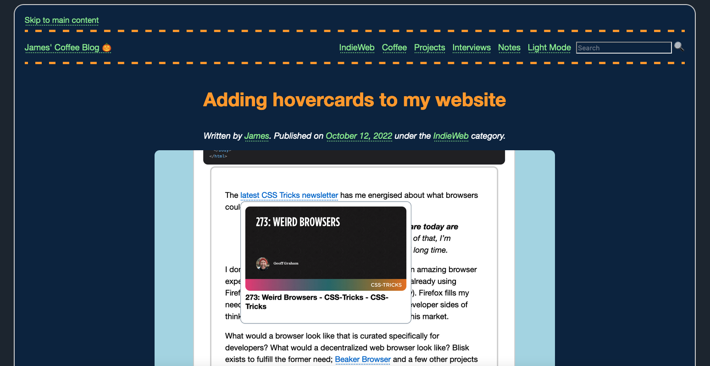

# darkmode.js

A script that lets you toggle dark mode on a website using a visitor's dark mode system configuration and a button on your website.

I use this script on [my website](https://jamesg.blog) to power my dark mode feature.

## Example Dark Mode



## Getting Started

The `darkmode.js` script lets you offer a dark mode toggle feature on your website. The script:

1. Checks if a visitor has set their system to prefer dark mode using the `prefers-color-scheme: dark` selector.
   - If a visitor prefers dark mode, a `<style` tag with the ID `darkmode` will be enabled on the page.
2. Checks if a visitor has set a dark mode preference on your website using a button on your page.
   - If a visitor has previously enabled or disabled dark mode on your website, their preference will be saved.
3. Creates a button at the end of a `<ul>` element with the id `top_navigation` that lets you toggle between light and dark mode.

This flow lets you:

1. Respect a visitor's existing system-level preference for light mode or dark mode.
2. Provide a system through which a visitor can toggle light or dark mode on your website, even if they have a system preference set.
3. Ensure the toggle works across a visitor's session.

## Usage

To use this script, download the `darkmode.js` script from this repository. Then, add the following tag close to the top of the `<head>` tag on your website:

```
<script src="./path/to/darkmode.js"></script>
```

Next, copy the code in `darkmode.html` and add it at the beginning of the `<body>` tag on your website. Replace the CSS comment with all the code that should be triggered when dark mode is enabled on your website. For an example, see `darkmode_example.html`.

## Contributing

If you have a suggestion on how to improve this script, please feel free to file an issue so improvements can be discussed before being turned  into Pull Requests.

## License

This project is licensed under an [MIT 0 license](LICENSE).

## Contributors

- capjamesg
